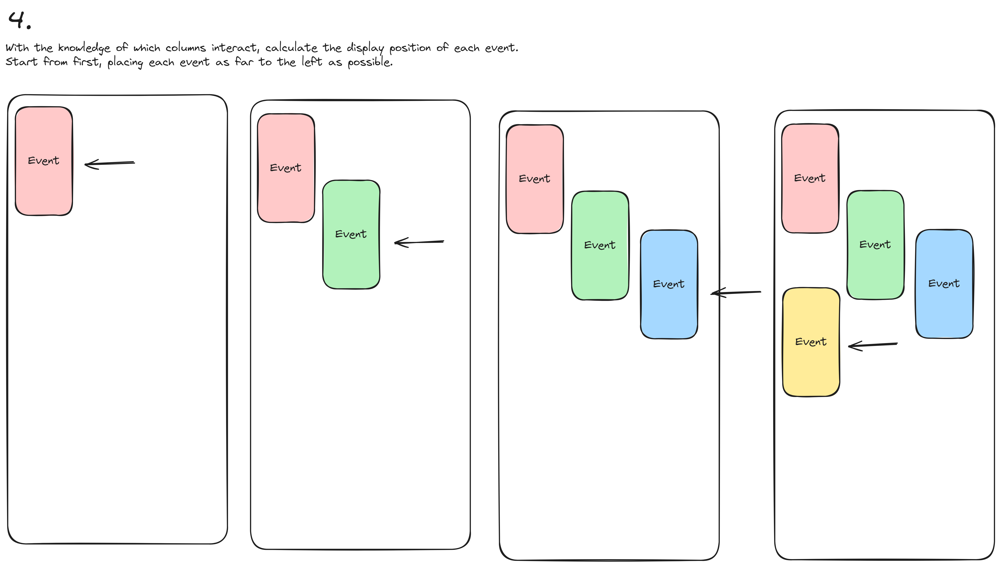

# Timer App
 
 Timer app is an MVP  `Next.js` project that I build for tracking tasks.

[Project URL](https://timer-app.thecallum.com/)

[Backend Repo](https://github.com/thecallum/timer_app_backend)


## Frontend
### Designing the App
I am not a designer, but I wanted the app to have a reasonably good UI. I had heard about the book https://www.refactoringui.com/ and thought it was worth a look. As a developer, I recommend this book. It's like the Pareto distribution of design, giving you the 20% of rules that will get you 80% of the results.
#### Top 3 takeaways from refactoring UI
##### Design in greyscale
It can be very easy to get carried away with colours when designing. I have found that a lot of time gets wasted trying out various colours, leading to a lot of unnecessary refactoring. 

Instead, the book suggests that you should initially design in greyscale. When you remove the colour, what are you left with? Spacing, font, contrast, size. It's much harder to build a good design in greyscale, but you'll be forced to get the other aspects of the design right. 

The magical part is when you add the colour back. You will be left with a much cleaner, more intuitive interface.

In greyscale


With colour


##### Don't add unless it's needed
Just like with agile, you should only build what you need, and no more. I've seen a lot of bad code caused by too much abstraction. The developer tries to be clever by anticipating some upcoming functionality. However, most of the time they are incorrect. They have built code that is unnecessarily complicated for functionality that we don't use. 

In the same way, by designing features that you may or may not need, you make the design more complex. And you make the process much slower. And you don't know yet what the users need. 

Instead, you should design the simplest version of the feature. Then you can ship the design, and see how it works for the user. Then you can ask, do we need to handle X? No, but perhaps we should handle Y instead.

##### Design by Elimination
This one I found incredibly useful. Often, I am trying to add some feature to the design, but it just doesn't look right. Let's say you have a button, but you're not sure what format looks the best. Create a copy, but make it slightly smaller. Then make another copy, that is slightly bigger. See which one you prefer.

If the bigger one is better, repeat the process. Make variations from that button. By following this approach, I was able to find solutions that I wouldn't have. 

As an example, here is a component that I used with different spacing. I designed the first one on the left. And whilst the one on the left looked fine when I initially designed it, I think it is clear that the spacing is much better on the last one. The spacing of the button at the bottom is best in the middle. 


### Choice of technology
Out of all the popular frontend frameworks, Next.js was the best choice for me. I could have used a simple client-side react app for this project, as there is little need for server-side rendering. However, I find the utility of implementing authentication server side preferable. 

I did briefly look into using Remix.js. It didn't look like there was much benefit to Remix over Next.js to warrant the additional time it would take to learn the framework. 

#### Deploying to lambda with SST
The biggest issue I had was deploying Next.js to a lambda function. One of the projects I've worked on has deployed Next.js on lambda. I tried to use the same serverless deployment approach, but that didn't work. The app would deploy, but it wouldn't start. That project uses Next.js 12, yet I'm using 14. And I don't want to downgrade the Next.js version just to deploy it. There must be another way!

I spend a few more days following various blog posts, always falling into some other issue that I couldn't get around. I'm sure if I had spent more time, I would have found a working solution. However, the breakthrough for me was to deploy the app via a different channel. SST.

https://sst.dev/
SST describes itself as a tool to make deploying a Next.js, Svelte or Astro app to AWS much easier. You might describe it as an alternative to serverless. It comes with other features, such as the ability to add databases, authentication etc. But I had no use for any of this. All I wanted was to get the app deployed to lambda.

I'm not going to go over how to add SST to your app, because [SST already has great documentation](https://docs.sst.dev/start/nextjs).

### Adding Popovers
Popovers are similar to modals, except the position is relative to the target element. For example, the popover on the right needs to appear next to the event that's being edited.


Luckily, there are plenty of libraries that do the heavy lifting for us. I picked [`popper.js`](https://popper.js.org/react-popper/v2/). Adding the basic popover was simple. The minimum code example used in the docs is the following:
```tsx
const { styles, attributes } = usePopper(referenceElement, popperElement);
```
#### Keeping each popover within its container

The next challenge, each popover needs to stay within the bounds of the screen. You can achieve this by setting the root boundary as the container element.

```tsx
const { styles, attributes } = usePopper(referenceElement, popperElement, {
	modifiers: [
		{
			name: 'preventOverflow',
			enabled: true,
			options: {
				altAxis: true,
				tether: false,
				escapeWithReference: false,
				boundariesElement: 'viewport',
				rootBoundary: containerRef,
			},
		}
	]
});
```

The popover will now stay within the container, even if the target element isn't visible.


#### Handle click-out logic for multiple popovers

The next problem I had, and the most difficult to resolve, was handling click-out events. The app has multiple layers of both modals and popovers. I needed a way to track which one close first.

For example, let's say you want to edit an event.


While editing the event, you open the list to select a different project.


But you can't find the project you want, so you then create a new project.


We needed a way to track closing these in the correct order.

##### Solution one - overlay background
The first solution was the simplest. Create an invisible overlay behind the popover, which when clicked, closes the modal. This solution worked great because the next popover would appear on top of the previous one, absorbing the click event.

However, there was one big caveat. If a second popover was open, the overlay would prevent the user from interacting with the first popover. For example, you might decide you don't want to change the project and click the save button. But clicking the save button wouldn't work. It just felt really clunky and was a bad user experience


##### Solution 2 - Tracking open modals
This is the solution I picked.

We need a way to handle the click events outside of each 
popover, and then to close the top one. The solution was a combination of two common design patterns, pub-sub and a stack (Last in First out).

1. When a modal or popover is created, it will subscribe to the hook. It will be placed at the top of the stack.
2. The hook has its own click event listener. If a click occurs, it will look for the subscriber at the top of the stack. However, it needs to identify whether the click is a valid click-out event. The hook will check if the click occurred outside of the element. If so, the callback is called and the component can respond by closing itself. 


Using the same example we used above, the project popover was created last, so it will be placed at the top of the stack. The hook is now waiting for click events. If the click occurs within the blue area, the hook will do nothing. If the click occurs outside the blue area, including the save button, the hook will trigger the callback. Other interactions, such as the save button, will behave as normal. 


#### Making popovers mobile friendly
The next issue, which I haven't had time to look into is how to handle the popover on mobile. You can see in the screenshot below, that these popovers result in an abysmal user experience on mobile. 


To resolve this issue, I would need to make popovers behave as a full-page modal on mobile. The popovers should fill the whole screen, and ignore the relative positioning of the target element.

An alternative solution would be to redirect the user to another page, instead of the modal. This approach would be more difficult to implement, but could potentially be a better user experience. 
### Working with Tailwind
> "As soon as you recognize that components are the abstraction for reusability and CSS just kinda gets in the way, Tailwind makes infinitely more sense." - Theo, 2024 [@t3dotgg](https://twitter.com/t3dotgg)

Working with Tailwind was a breeze. Once you get the hang of the syntax, styling components becomes so intuitive. 

The main problem I had with CSS is that it is global. There is always a risk that making a small change could break something on a completely separate page. This results in adding new, overly specific styles, to the CSS file. This inevitably leads to a CSS file that will balloon in size and complexity over time. 

Tailwind solves this problem.
#### Arbitrary values
https://tailwindcss.com/docs/adding-custom-styles#using-arbitrary-values

I have found a lot of utility in using arbitrary values. You can implement almost any CSS style. An example from the docs:

```tsx
<div className="bg-[#bada55] text-[22px] before:content-['Festivus']"> 
	<!-- ... --> 
</div>
```

I commonly use `calc()` when implementing a responsive container. This is how you can implement it with Tailwind.

```tsx
<div className="w-[calc(100%-30px)] max-w-800"> 
	<!-- ... --> 
</div>
```

You can also add before content. Again, something that can be very useful.
```tsx
<div className="before:content-['hello\_world']"> <!-- ... --> </div>
```

The only thing that I was unable to get working with arbitrary values was the `grid-template-areas` syntax. But since this won't be used much, you could easily implement this as vanilla CSS.

### Persistent timer
Another feature within the app is a timer. The timer is used to record whatever work the user is currently working on.


The timer needed to appear at the top of every page. This presented a couple of challenges.
#### How to maintain the timer between page reloads?
The simplest solution was to use local storage. When the timer is started, we save the current timestamp, selected project and description to local storage. 

When the page reloads, we check for any value in local storage and re-initialise the timer based on those values.

#### How to maintain the timer state between browser sessions?
Let's say the user starts the timer on their laptop, but then wants to close it on their phone. They won't have access to the local storage of the other device. 

There is a relatively simple solution for this. Store the recording state on the server.

On the backend, we could create the following table called `RecordingState`:

|Field|Data Type|Constraints|Description|
|---|---|---|---|
|userId|VARCHAR(255)|PRIMARY KEY, UNIQUE, NOT NULL|Unique identifier for the user.|
|startedAt|TIMESTAMP|NOT NULL|Timestamp when the recording was started.|
|description|TEXT|NOT NULL|Description of the recording state.|
|projectId|INT|OPTIONAL, FOREIGN KEY REFERENCES Project(projectId)|Optional project identifier as a foreign key.|
Then add the following endpoints:
##### GET /recording
- **Description**: Retrieves the current recording state for the logged-in user.
- **Error Response**:
    - **Code**: 404 Not Found
    - **Content**: `{ error: "No active recording found for this user." }`
- **Notes**:
    - The user's ID is derived from the session information.
    - This endpoint does not start or stop recordings but retrieves the current state if any.
##### POST /recording
- **Description**: Starts or updates a recording for the logged-in user. 
- **Data Params**:
    - **Description**: (Required) Description of the recording session.
    - **ProjectId**: (Optional) The project identifier this recording is associated with.
- **Success Response**:
    - **Code**: 201 Created
    - **Content**: `{ message: "Recording started successfully." }`
- **Success Response**:
    - **Code**: 200 Ok
    - **Content**: `{ message: "Recording updated successfully." }`
- **Notes**:
    - The endpoint should ensure that the `projectId`, if provided, references an existing project.
##### DELETE /recording
- **Description**: Stops the recording for the logged-in user, effectively deleting or marking the current recording state as inactive.
- **Error Response**:
    - **Code**: 404 Not Found
    - **Content**: `{ error: "No active recording found for this user to stop." }`

#### What if we stop recording when there is no internet?
This is actually a wider issue than saving a recording. How can we make the app more resilient to bad network connections? Currently, after stopping the recording, a `/createEvent` request is sent. But if that request fails, we don't do anything. The user just loses the recording. This is a serious user experience pitfall that needs to be resolved.

So a better question to ask is, how can we add more residency to to the app?

1. Implement an automatic retry mechanism which uses an exponential back-off approach (to avoid causing a Denial of Service to our backend). This would run if the status code returned is 5** or network-related
2. Implement a data syncing and offline storage layer. This involves storing the changes locally if the requests fail. But then sync that data when the connection is stable.

There are a few things to consider:
- Should we store the data locally by default, or only when the network fails?
- Periodically attempting to sync the changes when the network connection is stable.
- How do we handle data conflicts?
##### How do we handle conflicts when syncing over data?

The application wasn't designed for concurrent users. However, it is important to still consider conflicts. There are a few approaches we could take to handling conflicts:
- Last write wins (LWW) - The last update is used. 
- Versioning with timestamps - compare the different versions
- Client wins - anything from the client is prioritised
- Server wind - anything from the server is prioritised 
- User intervention

Conflict resolution should be carefully implemented based on the specific requirements of the application. For this app, the main actions that could cause conflict:
- Updating an event
- Updating a project
- Deleting an event
- Deleting a project

This application is built with a single user in mind. For this reason, the Last Write Wins approach makes the most sense. The last change the user made is what they want.

### Working with Playwright
I needed to implement E2E testing. I was recommended playwright and thought it was worth a try.

#### Recording user interactions
A while back, I read a great post by Kent C. Dodds called [Avoid the Test User](https://kentcdodds.com/blog/avoid-the-test-user).

To summarise, he talks about how it's important to only test the functionality that users care about in your application. For frontend E2E testing, you should test the application as the user. For example, you should click buttons, type into input fields etc.  

However, many tests are setup for a mysterious test user. This test user cares about implementation details. It tests that x occurs in the background. But doing so makes the tests more fragile. Making an implementation change would break the tests. But it shouldn't, as the actual functionality is identical for the user. 

I like to think of it this way. Let's say you have a car. The car is powered by a petrol engine. You want to test the following: the user presses the accelerator, expect the car moves forward.  

Let's say you decide to swap out that petrol engine for a diesel engine. The implementation of how the car works has changed. But the user interaction, and the ability to move forward, have remained the same. 

If you were testing the implementation details, the test would fail when you replaced the engine. Yet, this doesn't matter. you shouldn't be testing for this.

Anyway, the ability to generate the code from user interactions has huge implications. Of course, it is much faster to write the tests. However, I think it promotes the approach of testing for the user first, which will result in much better tests. 

### Screenshot testing
I have developed a love-hate relationship with screenshot testing. On the surface, it appears to be of great convenience. For example, the app contains a navigation component. I thought an easy way to test this was to take a screenshot, click the previous button, take another screenshot etc. I can then review the screenshots. Going forward, the test will compare against those changes.


But in reality, I found the screenshot tests would fail easily due to being a couple of pixels off. In this test example, I don't care what font is used. So for this kind of scenario, I think it will cause more inconvenience than it would save.

#### Overlooking changes
Only while writing this post did I notice that the font wasn't loading on the calendar, despite using screenshot tests. I must have seen the failing tests, updated the screenshots, and still overlooked them. I think this is an inherent flaw with this sort of test. 

==It's so easy to ignore the failing screenshot tests because you can regenerate them. Especially when the changes are small.

I also think these screenshots are too unstable to be reliable. It's a similar paradigm with CloudWatch alarms. If the threshold is too low, you learn to ignore the alerts. These screenshot tests kept failing because they were wrong by a few pixels. I learned to not take the failures too seriously. Resulting in a regression in functionality.

#### Takeaways
I have two take-always from using these screenshot tests
- If I'm testing actual data values, it's always better to manually test the values. That way, you have to address the underlying error
- When a screenshot test is needed, consider using HTML snapshots. Using a snapshot will compare the underlying HTML. This increases the stability of the test and makes it much clearer what has changed. 

### Connecting to Auth0
I wanted the E2E tests to behave as they would for the user. Therefore, the tests logged in via the Auth0 universal login, as a user would. However, I soon encountered a rate-limiting issue with Auth0. Auth0 would reject the login if the user wanted to log in multiple times. 

To get around this, I would need the auth cookies to be shared between the tests. And I would need the tests to know when to log back in. 

Firstly, I extended the base test file and configured all tests to use that.

When the test starts, it will try to load the existing auth cookies. Then it will navigate to the home page. If the user gets redirected to the login page, the code will authenticate via Auth0. If the user isn't redirected, there will be no need to update the authentication. 

```ts
import { Page, test as baseTest } from '@playwright/test'
export * from '@playwright/test'

const authFile = 'playwright/.auth/user.json'

export const test = baseTest.extend<{ page: Page }>({
  page: async ({ page }, use) => {
    // initialise existing storage state
    await page.context().storageState({ path: authFile })

    // implementation is really slow because it relies on waitForNavigation to time out
    //If there is a quicker way, potentially reversing the condition, that would be better

    try {
      await Promise.all([
        page.goto('http://localhost:3000'),
        page.waitForNavigation(),
      ])

	  // user navigated
      await handleLogin(page)
    } catch (error) {
      console.log('User didnt navigate. Auth is probably good.')
    }

    await use(page)
  },
})

const handleLogin = async (page: Page) => {
  const credentials = {
    email: process.env.TEST_ACCOUNT_EMAIL ?? '',
    password: process.env.TEST_ACCOUNT_PASSWORD ?? '',
  }

  await page
    .locator('div')
    .filter({ hasText: /^Login$/ })
    .click()
  await page.getByRole('button', { name: 'Login' }).click()
  await page.getByLabel('Email address').click()
  await page.getByLabel('Email address').fill(credentials.email)
  await page.getByLabel('Email address').press('Tab')
  await page.getByLabel('Password').fill(credentials.password)
  await page.getByLabel('Password').press('Enter')
}
```

This approach is very slow and clunky. I settled with it because it worked, and I wasn't planning on writing any new tests. 

However, I could try the following:
- Wait for a known element on the home page, that isn't on the login page. That way, the happy path is faster.
- Check for the presence of cookies. The test duration is too short for the cookies to expire before the tests complete

### Building out the complex column logic. How could I improve it?

#### How does the current setup work?

1. Sort the events into each day of the week.


2. For each day, generate a dictionary, with a key for each 5-minute slot in the day.


3. Add the ID of each event that fits into each slot. This enables us to easily see which events occur at the same time


4. Starting from the first event, place the event in the furthest left position. 



The width of the column will be `1 / MostConcurrentEvents`. For example, the most number of concurrent events is 3. So each column width is 1/3. I chose this approach because it's much easier to fit the events. 


Another reason I picked this approach is because the calendar is designed for one user, who is unlikely to have a lot of concurrent events. 

#### How could we improve this algorithm?

I think the best approach is to incrementally increase the width of each event if there is space.

1. Sort the events ordered by most concurrent events. This should result in most of the larger events being placed on the left
2. Use the existing sorting algorithm, setting the width of the columns so that all events will fit.
3. Next, find all events with 2 or less parallel events. Let them expand to the available width. This will need to be compared against the width of other parallel events. For example, if the other event has three paralleled events, that event can expand to 2/3 width.
4. Lastly, any column with no parallel events can be full-width.

## Backend

### Architecture Diagram


### Setting up Entity Framework Migrations in the Pipeline on a private database

The backend is a .NET API which uses Entity Framework Core. And since I'm using CircleCI as a CICD pipeline, I need a way to automatically apply the entity framework migrations. 

We cannot access the database directly because it's on a private subnet. The solution is to create a jump box. Essentially just an EC2 instance within that subnet with permissions to access the database. Then we just SSH into the jump box to apply the migration from there.

#### Step one - Setup the jump box
Create an EC2 instance. I used Amazon Linux, but it doesn't matter too much. Then I selected `t2.micro`, the cheapest instance type.

You will need to select or generate an RSA key, which will be used to SSH into the EC2 instance. Creating a new key pair will automatically download a PEM file. We will need that later


Within network settings, create a new security group which allows SSH traffic from anywhere. If you know the IP of the CICD pipeline, you could use that. 

You will also need to edit the security group of the database to allow `PostgreSQL` access to the security group of the jump box.

#### Step two - write the code in the pipeline
Next, I added the following to the CircleCI workflow.

1. Install SSH
2. Install AWS CLI
3. Install EF Core
4. Export the URL and the PEM key from SSM
5. Open an SSH tunnel into the jump box
6. Run `dotnet ef database update` against the database

`config.yml`
```yml
migrate-database:
description: Migrate database
parameters:
  stage:
	type: string
steps:
  - checkout
  - setup_remote_docker
  - run:
	  name: Install SSH client
	  command: apt-get update && apt-get install -y openssh-client
  - run:
	  name: Install Unzip
	  command: apt-get update && apt-get install unzip
  - run:
	  name: Install AWS CLI
	  command: >
		curl -L -o awscliv2.zip
		"https://awscli.amazonaws.com/awscli-exe-linux-x86_64.zip"

		unzip awscliv2.zip

		./aws/install
  - run:
	  name: Install dotnet ef core
	  command: dotnet tool install dotnet-ef --version 6.0.26 --tool-path
		./dotnet-ef-local/
  - run:
	  name: SSH into RDS and migrate database
	  command: |
		aws configure set region eu-west-2

		PORT=$(aws ssm get-parameter --name /timer-app/<<parameters.stage>>/db-port --query Parameter.Value)

		aws ssm get-parameter --name "/timer-app-jumpbox-pem-key" --output text --query Parameter.Value > ./private-key.pem
		chmod 400 ./private-key.pem

		HOST=$(aws ssm get-parameter --name /timer-app/<<parameters.stage>>/db-hostname --query Parameter.Value)
		INSTANCE_NAME=$(aws ssm get-parameter --name timer-app-jumpbox-instance-name --query Parameter.Value)
		PASSWORD=$(aws ssm get-parameter --name /timer-app/<<parameters.stage>>/db-password --query Parameter.Value)
		USERNAME=$(aws ssm get-parameter --name /timer-app/<<parameters.stage>>/db-username --query Parameter.Value)

		ssh -4 -Nf -L ${PORT//\"}:${HOST//\"}:${PORT//\"} -o "UserKnownHostsFile=/dev/null" -o "StrictHostKeyChecking=no" -o ServerAliveInterval=0 ec2-user@${INSTANCE_NAME//\"} -i ./private-key.pem

		CONN_STR="Host=127.0.0.1;Password=${PASSWORD};Port=${PORT};Username=${USERNAME};Database=<<parameters.stage>>"
	  
		cd ./timer_app/
				
		CONNECTION_STRING=${CONN_STR} ./../dotnet-ef-local/dotnet-ef database update -c timer_app.Infrastructure.TimerAppDbContext

```

### Providing network access to a Private Lambda

The RDS instance used for the project is hosted on a private subnet. The lambda function must be on the same subnet to gain access to the database. 

When I was implementing the authentication on the backend, I encountered a strange error. When validating a JWT token, the backend fetches the public key via the endpoint `https://{yourDomain}/.well-known/jwks.json`. However, a lambda on a private subnet does not have access to the internet. Meaning, the authentication timed out trying to fetch the public key. 

The solution is to enable the lambda function to make network requests via a NAT gateway. A NAT gateway behaves like a router in your home network. 

However, on AWS, a NAT gateway costs $30/month. This is something I'm not willing to pay for a hobby project. For this reason, the database is now publicly accessible. The reason I used Lambda is because it is pay-per-use, which makes it very cheap for a hobby project. Being forced to pay a flat fee of $30/month is completely unreasonable for this use case.

## Authenticating the app with Auth0
[Auth0](https://auth0.com/) is a popular service for managing authentication for any given application. I wanted to use this project as an opportunity to use it.

### OAuth grant types
I had to choose between an implicit grant and an authorization code grant. 

An implicit grant will return the `access_token` directly to the browser. This is recommended for any applications without a backend, such as a SPA. This grant type is now actively recommended against due to the security risks.

An authorization code grant will return an authorization code to your backend service. This code by itself is useless, so it doesn't matter if anyone steals it. However, when you combine the code with the `client_id` and `client_secret`, you can fetch an `access_token`. 

### Setting up Auth0 account
The first thing you will need to create is a new `Regular Web Application`.


After creating the application, populate the following fields.

| Setting                           | Value                                       | Description                                                                                                                                                                                                                                                                                               |
| --------------------------------- | ------------------------------------------- | --------------------------------------------------------------------------------------------------------------------------------------------------------------------------------------------------------------------------------------------------------------------------------------------------------- |
| Allowed Callback URLs             | http://localhost:3000/api/authorize         | This is the URL in your application that you're redirected to on a successful login. The code and state will be passed.                                                                                                                                                                                     |
| Allow Cross-Origin Authentication | `false`                                     | We don't need this feature because we're using the universal login page.                                                                                                                                                                                                                                  |
| ID Token Expiration               | 3000 (ideally the same as the access_token) |                                                                                                                                                                                                                                                                                                           |
| `refresh_token` Rotation            | `true`                                      | When an `access_token` has expired, and the `refresh_token` is used to fetch a new `access_token`, that `refresh_token` will be revoked. This prevents the `refresh_token` from being used again if leaked.                                                                                                 |
| Reuse Interval                    | 5 seconds                                   | The application automatically fetches a new `access_token` if it expires. However, this creates a race condition. If multiple requests are made, the `refresh_token` will be used multiple times. But since we're using rotation, the second request would fail. Adding a small window resolves this issue. |
| `refresh_token` Expiration          | `true`                                      |                                                                                                                                                                                                                                                                                                           |
| Absolute Lifetime                 | 86400 seconds                               | This is somewhat redundant. Either the token is revoked due to inactivity, or the `refresh_token` is revoked fetching a new `access_token`.                                                                                                                                                               |
| Inactivity Expiration             | 3600 seconds                                |                                                                                                                                                                                                                                                                                                           |
| Grant Types                       | `Authorization Code`, ``refresh_token``       |                                                                                                                                                                                                                                                                                                           |


Next, create a new API.


| Setting                            | Value       | Description                                                                    |
| ---------------------------------- | ----------- | ------------------------------------------------------------------------------ |
| Token Expiration                   | 300 seconds | When an `access_token` expires, we can use the `refresh_token` to fetch a new one. |
| Token Expiration For Browser Flows | 300 seconds | We don't need this option. But I will set it the same as the token expiration. |
| Allow Offline Access               | `true`      | Enable the authorization endpoint to return `refresh_token`s.                    |
### Adding the login button

First, we add a login button that navigates to Auth0's Universal Login page.

```tsx
<a 
	href={`${AUTH_DOMAIN}/authorize?state=${state}&response_type=code&scope=${AUTH_SCOPE}&client_id=${CLIENT_ID}&audience=${AUTH_AUDIENCE}&redirect_uri=${REDIRECT_URI}`}
>Login</a>
```

We're using the following variables:

| Variable      | Description                                                                                                                                                                                                                          | Example                               |
| ------------- | ------------------------------------------------------------------------------------------------------------------------------------------------------------------------------------------------------------------------------------ | ------------------------------------- |
| domain        | The URL for the Universal Login Page.                                                                                                                                                                                                | dev-ig3jfdtaxdzredhy.uk.auth0.com     |
| response_type | Specify the OAuth grant types. So for us, we use 'code'                                                                                                                                                                              |                                       |
| state         | The state variable is used to prevent CSRF attacks. It will be compared against a cookie in the authorization endpoint. https://auth0.com/docs/secure/attack-protection/state-parameters                                             |                                       |
| scope         | Defines which scopes are used in the authentication process. For example, 'openid' indicates the requirement to verify the user's identity. 'email' will include the user's email in the response.                                   | 'openid profile email offline_access' |
| client_id     | ID of the application                                                                                                                                                                                                                | R2kS8d09b7DV0NLJ6LMqEVioOLd83mPS      |
| audience      | The identifier of the API created in Auth0                                                                                                                                                                                           | https://localhost:3000                |
| redirect_uri  | This is the URL that Auth0 will redirect back to after a successful login. This will be an API route, as we will need to use the code to fetch an `access_token`. This value must match one of the values provided in the application. | http://localhost:3000/api/authorize   |

### Add the authorize redirect API endpoint

Below, I have added a simplified version of the authorization endpoint.

1. Compare the state cookie against the returned state value. If they don't match, redirect to the login page.
2. Send a request to Auth0s `Get `access_token`s` endpoint
3. If successful, set store the tokens in cookies, and redirect to the home page
4. If the request fails, redirect the user back to the login page

```ts
export default async (req: NextApiRequest, res: NextApiResponse) => {
  const state = req.query.state as string;
  const cookies = req.cookies;
  const stateCookie = cookies[AUTH_STATE_COOKIE_NAME] ?? null;

  if (stateCookie !== state) {
    console.info("State didnt match stored state");
    res.redirect("/login");
    return;
  }

  const code = req.query.code as string;

  const config: AxiosRequestConfig = {
    method: "post",
    url: `${AUTH_DOMAIN}/oauth/token`,
    headers: {
      "Content-Type": "application/x-www-form-urlencoded",
    },
    data: {
      grant_type: "authorization_code",
      client_id: CLIENT_ID,
      client_secret: CLIENT_SECRET,
      redirect_uri: REDIRECT_URI,
      code,
    },
  };

  try {
    const response = await axios.request(config);

    const accessToken = response.data["access_token"];
    const refreshToken = response.data["refresh_token"];
    const idToken = response.data["id_token"];

    setCookies(res, accessToken, refreshToken, idToken);
    res.redirect("/");
  } catch (error) {
    console.error("Failed to authorize `access_token`", error);
    res.redirect("/login");
    return;
  }
};
```

### Add the logout button
JWTs are stateless, you cannot revoke an `access_token`. So how do we get around this?

Firstly, we can create `access_token`s with a shorter lifespan. I chose 5 minutes. We then use `refresh_token`s to fetch a new `access_token` when the fresh token has expired. Then, we can revoke the `refresh_token`.

This is not ideal, as after logging out, the `access_token` will be valid for the remainder of the 5 minutes. There is another way to mitigate this, which I will go over later.

Simplified code for the logout route
```tsx
export default async (req: NextApiRequest, res: NextApiResponse) => {
  const cookies = req.cookies
  const refreshToken = cookies[REFRESH_TOKEN_COOKIE_NAME] ?? null

  const config: AxiosRequestConfig = {
    method: 'POST',
    url: `${AUTH_DOMAIN}/oauth/revoke`,
    headers: { 'content-type': 'application/json' },
    data: {
      client_id: CLIENT_ID,
      client_secret: CLIENT_SECRET,
      token: refreshToken,
    },
  }

  try {
    await axios.request(config)

    deleteAllCookies(res)
    res.redirect('/login')
  } catch (error) {
    res.redirect('/')
  }
}
```

##### How could we revoke access tokens?
As mentioned above, it isn't possible to revoke an `access_token`. The solution we took was to reduce the lifetime of the `access_token`, and use the `refresh_token` to fetch a new `access_token`. 

Even after revoking a `refresh_token`, the `access_token` is still valid for the remainder of the 5 minutes. How could we invalidate this token early?

The solution would be to store a reference to that `access_token` in a database. When validating a token, we could check to see if it's listed in the database. DynamoDB would be a perfect solution for this because it is cheap and very fast for get-by-id transactions.

DynamoDB supports [TTL item expiration](https://aws.amazon.com/about-aws/whats-new/2017/02/amazon-dynamodb-now-supports-automatic-item-expiration-with-time-to-live-ttl/). We would incorporate this approach to automatically delete the record from the database when the `access_token` would have expired.

### Verifying access tokens

There are three steps required for validating a JWT token:

1. **Verify token audience claims**. The JWT tokens we are receiving from the Auth0 API are signed using RS256. We can use the public key to verify the signature. You can manually export the key, but Auth0 recommends fetching it from the endpoint `https://{yourDomain}/.well-known/jwks.json`
2. **Verify token audience claims**. The audience claim identifies the intended recipients of the JWT. This could be a specific application, a multiple application, or for public use. This value is intended to prevent abuse of the token. **The creator of the token does not enforce that the audience is validated correctly. The responsibility is the recipient's to determine whether the token should be used.**
3. **Verify permissions (scopes).** Scope claims define a list of permissions for a given client. The application should verify the `access_token` contains these scopes when performing a given action. For example, the client is trying to call the `/create` endpoint. You may want to verify the `access_token` contains the `create:users` scope.

The way we implement this will vary slightly between frontend and backend.

### Protecting the backend
Adding authorization to the backend is much simpler than the frontend.

In `Startup.cs`, add the following to Configure Services.

```cs
services.AddAuthentication(JwtBearerDefaults.AuthenticationScheme).AddJwtBearer(
	options =>
	{
		options.Authority = Environment.GetEnvironmentVariable("Auth0_Domain");
		options.Audience = Environment.GetEnvironmentVariable("Auth0_Audience_AccessToken");

		options.TokenValidationParameters = new TokenValidationParameters
		{
			ValidateIssuer = true,
			ValidateAudience = true,
			ValidateLifetime = true,
			ValidateIssuerSigningKey = true,
			ClockSkew = TimeSpan.Zero
		};
	});
```

This is middleware that will verify the signature (by fetching the public key from `https://{yourDomain}/.well-known/jwks.json`), verify the audience, and then verify the `access_token` hasn't expired.

Then add the following like to `Configure`:

```cs
 app.UseAuthentication();
```

#### Accessing the user
So far we have verified the `access_token`. If the request has got this far, the client has been granted access to the API. However, we don't yet know who the user is. We need to Authorize the user.

Initially, I was fetching user data from the `GET /userinfo` endpoint. However, I soon encountered rate-limiting issues. So I switched to using an [`id_token`](https://auth0.com/docs/secure/tokens/id-tokens) which provides cached user profile information. 

I would need to validate the `id_token` in the same way I validate the `access_token`. First, we can verify the signature by fetching the public key, then verify the audience.

```cs
public async Task<ClaimsPrincipal> ValidateIdToken(string idToken)
	{
		var issuer = Environment.GetEnvironmentVariable("Auth0_Domain");
		var audience = Environment.GetEnvironmentVariable("Auth0_Audience_IdToken");

		// Ensure issuer ends with a slash
		if (!issuer.EndsWith("/")) issuer += "/";

		var configurationManager = new ConfigurationManager<OpenIdConnectConfiguration>(
	   $"{issuer}.well-known/openid-configuration",
	   new OpenIdConnectConfigurationRetriever(),
	   new HttpDocumentRetriever());

		var openIdConfig = await configurationManager.GetConfigurationAsync(CancellationToken.None);

		// Validate the token
		var validationParameters = new TokenValidationParameters
		{
			ValidateIssuer = true,
			ValidIssuer = issuer,
			ValidateAudience = true,
			ValidAudience = audience,
			ValidateLifetime = true,
			ValidateIssuerSigningKey = true,
			IssuerSigningKeys = openIdConfig.SigningKeys,

			ClockSkew = TimeSpan.Zero
		};

		var handler = new JwtSecurityTokenHandler();
		var principal = handler.ValidateToken(idToken, validationParameters, out var validatedToken);
		return principal;
	}
```

The `ValidateToken` method returns a `ClaimsPrincipal` object, making it easy to verify the claims against the JWT.

https://learn.microsoft.com/en-us/dotnet/standard/security/principal-and-identity-objects

Next, I added a `UserMiddleware` class to validate the `id_token`, then initiated the class `UserService`.

```cs
public class UserMiddleware
{
	private readonly RequestDelegate _next;

	public UserMiddleware(RequestDelegate next)
	{
		_next = next;
	}

	public async Task Invoke(HttpContext httpContext, IUserService userService, ITokenValidator tokenValidator)
	{
		var idToken = httpContext.Request.Headers[HeaderConfig.IdToken].ToString();

		if (string.IsNullOrEmpty(idToken))
		{
			httpContext.Response.StatusCode = 403;
			await httpContext.Response.WriteAsync($"Invalid {HeaderConfig.IdToken}");
			return;
		}

		try
		{
			var principal = await tokenValidator.ValidateIdToken(idToken);

			await userService.InitialiseUser(principal);
			httpContext.User = userService.GetUser();

			await _next(httpContext);
		}
		catch (Exception)
		{
			httpContext.Response.StatusCode = 403;
			await httpContext.Response.WriteAsync($"Invalid {HeaderConfig.IdToken}");
			return;
		}
	}
}
```

The `UserService` class makes accessing user identity easier, and is initiated with the `ClaimsPrincipal` object returned when verifying the `id_token`. 

```cs
public class UserService : IUserService
{
	private ClaimsPrincipal? User;

	public async Task InitialiseUser(ClaimsPrincipal principal)
	{
		User = principal;
	}

	public ClaimsPrincipal GetUser()
	{
		return User;
	}

	public string GetId()
	{
		var identity = User.Identities.FirstOrDefault();
		var claims = identity.Claims.ToList();

		var userId = claims.FirstOrDefault(x => x.Type.Equals(ClaimTypes.NameIdentifier))?.Value;

		return userId;
	}
}
```

We will use a scoped lifecycle, as we want the `UserService` to be created for each request. 

```cs
services.AddScoped<IUserService, UserService>();
```

### Protecting the frontend

Each frontend page is set up to authenticate server-side. I achieved this by adding the following to each page.

```tsx
export const getServerSideProps = withAuthServerSideProps()
```

The method does a lot, so let me break it down.

1. Extract cookies from the request
2. Validate the `access_token` (essentially the same approach we used on the backend)
3. If the `access_token` is valid, we allow the page to load
4. If the `access_token` has expired, we then try to use the `refresh_token` to fetch a new `access_token`.
5. If the `refresh_token` is valid, we will update the cookies with the new `access_token` and `refresh_token`, and then allow the page to load
6. If the `refresh_token` is invalid, delete all of the cookies, and redirect the user to the login page.

```tsx
export const withAuthServerSideProps = (
  getServerSidePropsFunc?: GetServerSideProps,
) => {
  return async (context: GetServerSidePropsContext) => {
    const { req, res } = context
    const cookies = req.cookies
    let accessToken = cookies[ACCESS_TOKEN_COOKIE_NAME] ?? null
    let refreshToken = cookies[REFRESH_TOKEN_COOKIE_NAME] ?? null

    const tokenValid = await validateToken(accessToken)

    if (!tokenValid) {
      const refreshTokenResult = await refreshAccessToken(refreshToken)

      if (refreshTokenResult === null) {
        deleteAllCookies(res)

        return {
          redirect: {
            destination: '/login',
            permanent: false,
          },
        }
      }

      accessToken = refreshTokenResult.accessToken
      refreshToken = refreshTokenResult.refreshToken

      setCookies(res, accessToken, refreshToken, refreshTokenResult.idToken)
    }

    if (getServerSidePropsFunc) return getServerSidePropsFunc(context)

    return {
      props: {},
    }
  }
}
```

### Intercepting network requests
Next, I added the API endpoint `[...path].ts`. This endpoint will catch all API requests, and forward them to the backend API. 

I added this for a few reasons:

1. Pass the API Gateway API Key in the requests without expositing it to the front end. I removed this functionality when debugging the backend authentication, and inadvertently forgot to add it back. An API Key is a great way to protect an endpoint, although is not recommended to be used in isolation. 
2. Hide the URL of the backend API. This adds some additional security by hiding the actual URL of the backend.
3. Automatically refresh an expired `access_token`

```tsx
const API_URL = Config.SERVICE_API_URL

export default async function handler(
  req: NextApiRequest,
  res: NextApiResponse,
) {
  const { url, method, body, headers } = req

  let accessToken = extractCookie(headers, ACCESS_TOKEN_COOKIE_NAME)
  let refreshToken = extractCookie(headers, REFRESH_TOKEN_COOKIE_NAME)
  let idToken = extractCookie(headers, ID_TOKEN_COOKIE_NAME)

  if (!(await isAuthorized(accessToken))) {

    const result = await refreshAccessToken(refreshToken)
    if (result === null) {
      deleteAllCookies(res)
      res.status(401).end()
      return
    }

    accessToken = result.accessToken
    refreshToken = result.refreshToken
    idToken = result.idToken

    setCookies(res, accessToken, refreshToken, idToken)
  }

  console.info(`Forwarding request to ${url}`)

  try {
    const apiResponse = await axios.request({
      url,
      baseURL: API_URL,
      method,
      headers: {
        Authorization: `Bearer ${accessToken}`,
        IdToken: idToken,
      },
      data: body,
    })

    if (apiResponse.status === 200) {
      res.status(200).json(apiResponse.data)
    } else {
      res.status(apiResponse.status).end()
    }
  } catch (e) {
    const error = e as AxiosError

    console.info(
      'invalid request',
      { status: error?.response?.status },
      error.message,
    )

    if (error.response?.status === 401) {
      deleteAllCookies(res)
    }

    if (error.response === null || error.response === undefined) {
      throw new Error(error.message)
    }

    // eslint-disable-next-line @typescript-eslint/no-explicit-any
    res.status(error.response.status).json(error.response.data as any)
  }
}

const extractCookie = (headers: IncomingHttpHeaders, cookieName: string) => {
  const parsedCookies = cookie.parse(headers.cookie as string)

  try {
    return parsedCookies[cookieName]
  } catch (error) {
    return null
  }
}

const isAuthorized = async (accessToken: string | null) => {
  if (accessToken === null) return false

  return await validateToken(accessToken)
}

```
### Utility Frontend Request Helper Method
All frontend requests are configured to use the following utility function. If a request returns 401, the user is automatically redirected to the login page. This prevents the user from seeing a wall of 401 errors if the session has expired. 

```tsx
export const frontendRequest = async (config: AxiosRequestConfig) => {
  try {
    return await axios(config)
  } catch (e) {
    const error = e as AxiosError

    if (error?.response?.status === 401) {
      Router.push('/login')
    }

    throw error
  }
}
```
